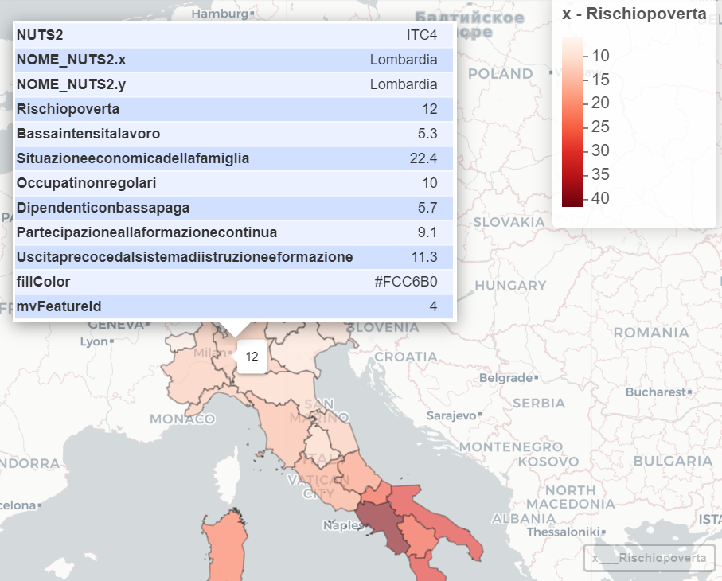
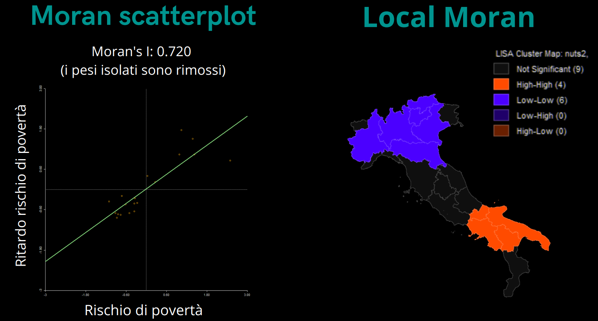
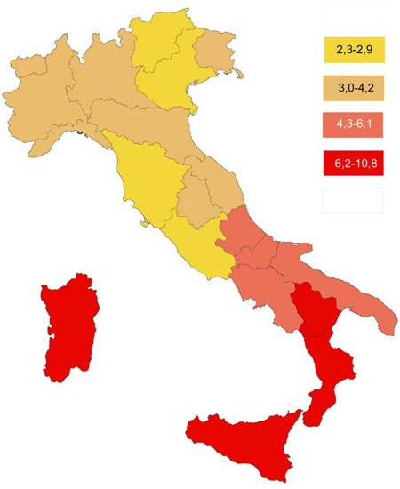

# Geographical Data Analysis of Poverty in Italy

This project explores poverty in Italy through a geographical and statistical perspective, using data from ISTAT and BES (Benessere Equo e Sostenibile).  
The analysis combines descriptive statistics, spatial autocorrelation tests, and spatial regression models to highlight territorial inequalities and socio-economic drivers of poverty.

The analysis is based on a poverty rate dataset from Italian Statistical Institute ISTAT [avaiable here](data/readme.md) that contains 8 sociodemographic variables [listed here](data/vardescription.md) and is analized by 5 main scripts in `src` [descripted here](src/readme.md)

- [Interactive map](https://sasyspanish.github.io/Geographical-Data-Analysis-of-Poverty-in-Italy-with-R/results/maps/map.html) of poverty risk in Italy
- ↓ Screenshot from the [Interactive map](https://sasyspanish.github.io/Geographical-Data-Analysis-of-Poverty-in-Italy-with-R/results/maps/map.html) ↓ 
- 
---

## Objectives
- Analyze the risk of poverty across Italian regions
- Study socio-economic differences using BES indicators
- Apply spatial autocorrelation tests (Moran’s I, Geary’s C)
- Compare spatial regression models (SAR, SAC)

---

## Workflow
1. **01_data_preparation.R** → Load shapefile and poverty dataset, merge, clean, and explore.  
2. **02_exploratory_analysis.R** → Descriptive statistics, plots, and OLS baseline models.  
3. **03_spatial_weights.R** → Build spatial weight matrices (Queen contiguity).  
4. **04_spatial_tests.R** → Moran’s I, Geary’s C, and Local Indicators of Spatial Autocorrelation (LISA).  
5. **05_spatial_models.R** → Estimate SAR and SAC spatial regression models, compare AIC, compute direct and indirect effects.

---

## Technologies
- **Language**: R  
- **Main Libraries**:  
  - `sf` – spatial data handling  
  - `spdep` – spatial dependence models  
  - `ggplot2` – data visualization  
  - `dplyr` – data wrangling  

---

## Key [Results](results/readme.md)

## Regression Analysis
The linear regression model identifies the main drivers of poverty risk:

- **Low work intensity**: strong positive and highly significant effect. Regions with lower labor intensity show higher poverty risk.  
- **Household economic situation**: negative and significant. Better family economic conditions reduce poverty risk.  
- **Continuous training participation**: negative and significant. Lifelong learning acts as a protective factor against poverty.  
- **Early school leaving**: positive and significant. Dropping out of education increases poverty risk.  

The model shows excellent fit (**Adjusted R² = 0.98**), confirming that these socio-economic variables explain most of the variance in poverty risk.

---

## Spatial Effects (SAC Model)
The spatial autoregressive model highlights that poverty is **not randomly distributed**, but spreads across neighboring regions:

- **Low work intensity**: strong positive direct effect, but negative indirect effect on neighboring areas (suggesting compensatory dynamics).  
- **Household economic situation**: positive indirect effect, meaning economic hardship in one region tends to spill over into adjacent areas.  

These findings imply the need for **coordinated regional policies**, since poverty dynamics do not stop at administrative borders.

---

## Spatial Autocorrelation (Moran’s I and Local Moran)
- 
- **Moran’s I = 0.72** → strong positive spatial autocorrelation. High-poverty regions cluster together, as do low-poverty regions.  
- **LISA Cluster Map**:
  - **High-High cluster**: Southern Italy (critical poverty risk hotspot).  
  - **Low-Low cluster**: Northern Italy (low poverty risk concentration).  
  - No regions fall into **Low-High** or **High-Low** outliers.  

---

## Conclusions
- Poverty risk in Italy is **strongly linked to labor conditions, household economy, and education**.  
- The phenomenon has a **clear spatial dimension**, with persistent **North-South disparities**. 
 - 
- [Policy implications](pnrr.md):
  - Invest in **quality employment** and **lifelong learning**.  
  - Develop **interregional strategies**, since poverty spreads across territories.  

- Poverty in Italy is not only a **social issue**, but also a **spatial one**:  
it concentrates in specific areas and propagates across neighboring regions, calling for **comprehensive and territorial policies**.

 
---

## References
- ISTAT – Italian National Institute of Statistics  
- BES Project – Equitable and Sustainable Well-being indicators  
- European Pillar of Social Rights (EPSR)  
- Italian National Recovery and Resilience Plan(PNRR)  

## 
From a F.Cecere, G.Masiello & S.Spagnuolo collaboration.
