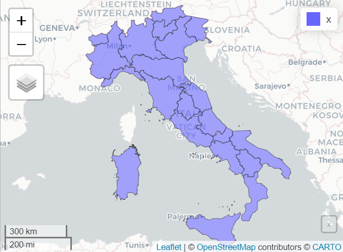

# Geographical Data Analysis of Poverty in Italy

This project explores poverty in Italy through a geographical and statistical perspective, using data from ISTAT and BES (Benessere Equo e Sostenibile).  
The analysis combines descriptive statistics, spatial autocorrelation tests, and spatial regression models to highlight territorial inequalities and socio-economic drivers of poverty.
- [Interactive map (download html file to see)](map.html) of poverty in italy
- 
- 
---

## Objectives
- Analyze the risk of poverty across Italian regions
- Study socio-economic differences using BES indicators
- Apply spatial autocorrelation tests (Moran’s I, Geary’s C)
- Compare spatial regression models (SAR, SAC)

---

## Workflow
The project is divided into 5 main scripts in `src` [and better descripted here](src/readme.md):

1. **01_data_preparation.R** → Load shapefile and poverty dataset, merge, clean, and explore.  
2. **02_exploratory_analysis.R** → Descriptive statistics, plots, and OLS baseline models.  
3. **03_spatial_weights.R** → Build spatial weight matrices (Queen contiguity).  
4. **04_spatial_tests.R** → Moran’s I, Geary’s C, and Local Indicators of Spatial Autocorrelation (LISA).  
5. **05_spatial_models.R** → Estimate SAR and SAC spatial regression models, compare AIC, compute direct and indirect effects.

---

## Technologies
- **Language**: R  
- **Main Libraries**:  
  - `sf` – spatial data handling  
  - `spdep` – spatial dependence models  
  - `ggplot2` – data visualization  
  - `dplyr` – data wrangling  

---

## Key [Results](results/readme.md)
- Strong territorial divide between Northern and Southern Italy in terms of poverty risk  
- Moran’s I ≈ 0.72 → strong spatial autocorrelation detected  
- **SAC model** outperformed SAR (lower AIC score)  
- Policy implications connected to PNRR and European Pillar of Social Rights  

---

## References
- ISTAT – Italian National Institute of Statistics  
- BES Project – Equitable and Sustainable Well-being indicators  
- European Pillar of Social Rights (EPSR)  
- Italian National Recovery and Resilience Plan (PNRR)  

## 
From a F.Cecere, G.Masiello & S.Spagnuolo collaboration.
