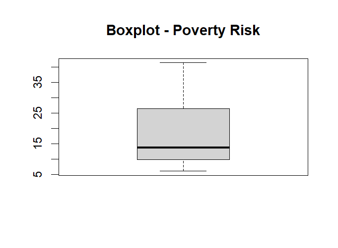
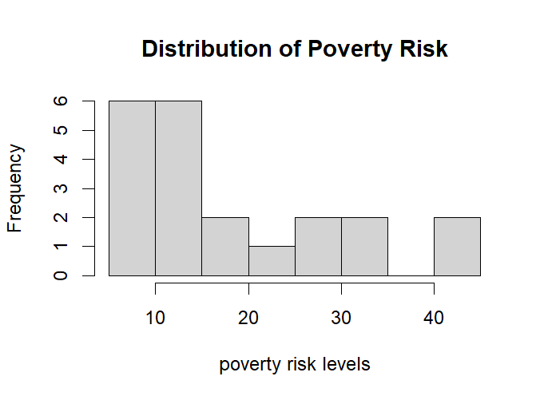
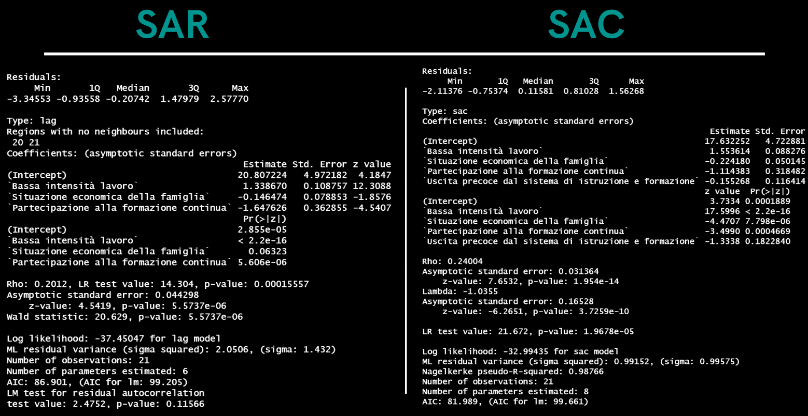
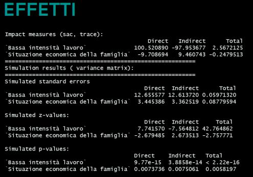
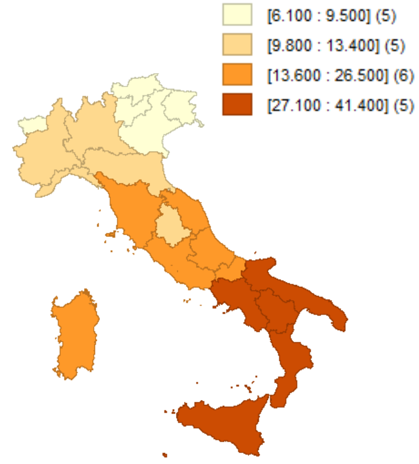

# Results

This section summarizes the main findings of the project *Geographical Data Analysis of Poverty in Italy*.  
The analysis combined descriptive statistics, spatial autocorrelation tests, and spatial regression models (SAR and SAC).  
- [Variable Description brief](vardescription.md)
- [Interactive poverty map](maps/map.html)
---

## Descriptive Analysis
- The **distribution of poverty risk** across Italian regions shows **positive skewness**: most regions have relatively low values, but some regions experience very high poverty risk.  
- Boxplots and histograms highlight **regional disparities** and the presence of extreme cases.  

  
  

---

## Spatial Autocorrelation
- **Moran’s I ≈ 0.72** → indicates **strong positive spatial autocorrelation**: regions with high poverty risk tend to be surrounded by regions with similar high values, and vice versa.  
- **Geary’s C** confirms positive spatial dependence.  
- **Local Moran’s I (LISA)** identifies:
  - **High–High clusters** in the South of Italy (regions with high poverty surrounded by similar regions)  
  - **Low–Low clusters** in the North (regions with low poverty surrounded by similar regions)  
  - Few isolated High–Low or Low–High cases  

  

---

## Spatial Regression Models
- Initial **OLS models** explained part of the variation in poverty risk but ignored spatial dependence.  
- **LM tests** suggested that spatial models (SAR/SEM/SAC) were more appropriate.  
- After comparison:
  - **SAR model**: significant but less effective (higher AIC)  
  - **SAC model**: best fit with **lowest AIC**, capturing both spatial lag and spatial error dependence  

**Model comparison (AIC):**  
- SAR ≈ 86.9  
- SAC ≈ 81.9 → **preferred model**  

  

- **Direct and indirect effects** (from SAC) show that socio-economic factors in one region can have **spillover effects** on neighboring regions. For example:
  - **Low work intensity** in one region not only increases local poverty risk, but also influences poverty risk in adjacent regions.  

  

---

## Policy Implications
- The strong **North–South divide** in poverty risk highlights structural inequalities within Italy.  
- Spatial dependence suggests that **regional policies cannot be isolated**: interventions in one region can affect neighboring regions.
- 
- Findings are consistent with EU and national frameworks such as:
  - **European Pillar of Social Rights (EPSR)**  
  - **Italian National Recovery and Resilience Plan (PNRR)**  

---

## Conclusions
- **Objectives achieved**:
  - ✅ Analyzed poverty risk across Italian regions  
  - ✅ Studied socio-economic indicators and their influence  
  - ✅ Verified spatial autocorrelation (Moran’s I, Geary’s C, LISA)  
  - ✅ Compared OLS and spatial regression models  
  - ✅ Identified **SAC** as the best-performing model  
- **Key insight**: Poverty in Italy is **not randomly distributed**, but **spatially clustered**. Regional inequalities are reinforced by spatial dependence, requiring **coordinated policy measures**.

---

